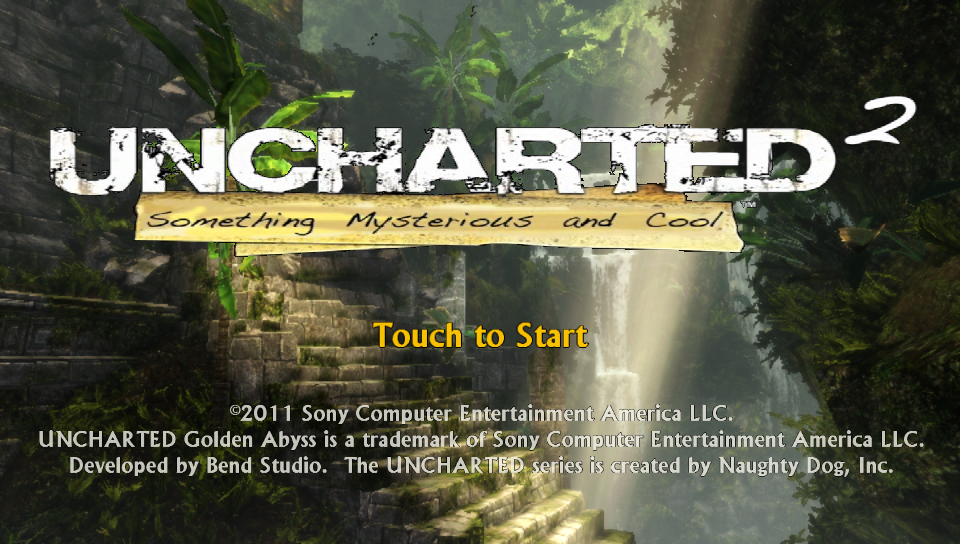
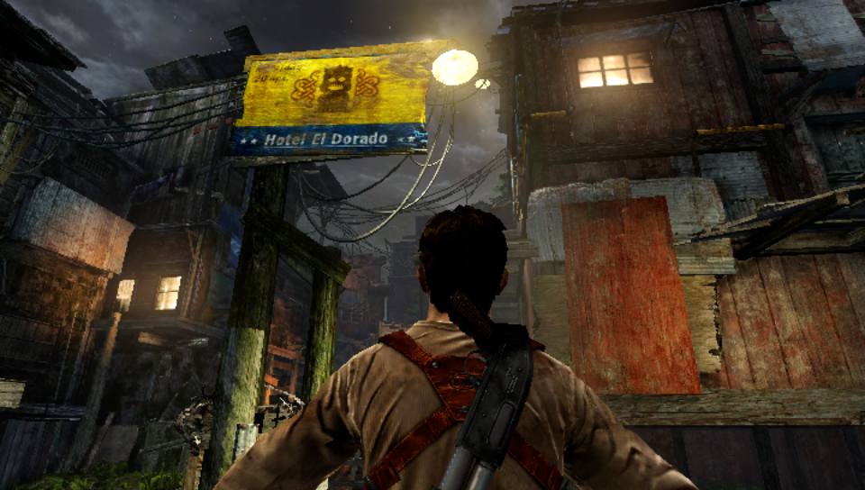

# HG2PatchCreator
Tool for creating a valid patch.bin for Uncharted Golden Abyss

# Pre-requisites
- [rePatch](https://github.com/dots-tb/rePatch-reDux0) plugin has to be installed on your psvita

# Tutorial

Uncharted Golden Abyss stores it's assets in a file called gamedata.bin. It also support another archive used to patch/replace data at run-time called patch.bin

Let's create a custom patch.bin that's gonna replace the game's logo in the main menu and another texture in the Shanty Town level.

Grab the two files from **examples** folder and place them in same folder as the executable.

Now open the terminal and run the following command
```
.\HG2PatchCreator.exe .\logo.bstex game/ui/textures/mm_game_logo.bstex .\granary_sign.bstex game/regions/shanty_town/village/a3_middle_village/textures/granary_sign.bstex
```
The first argument is the file that you want to include in the archive the second argument is the filepath inside the gamedata (you can get those from extracting the gamedata.bin with [this](https://github.com/mhvuze/UGAdata) tool)

Grab the newly created **patch.bin** and place it in the **ux0:rePatch/title_Id** folder on your psvita.

Start the game and if you did everything correctly you should see the new logo in the main menu


and if you load chapter - 6 - the Hotel El Dorado sign from Uncharted 2
